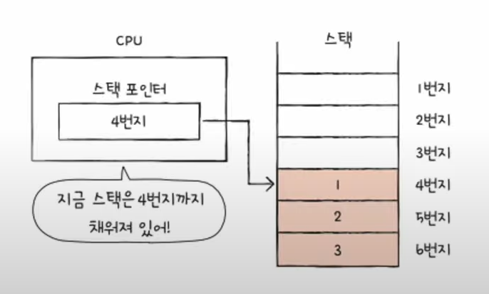
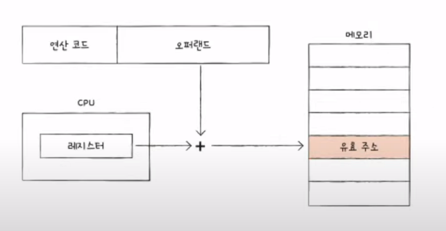
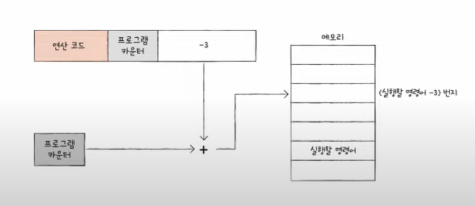
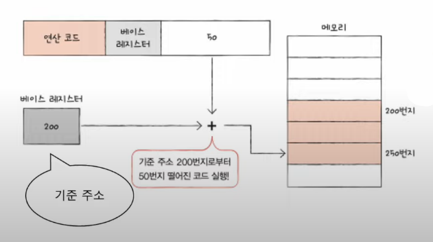

# 레지스터
상용화된 CPU 속 레지스터들은 CPU마다 이름, 크기, 종류가 매우 다양하다.

<꼭 알아야 하는 레지스터>

## 1. 프로그램 카운터(PC : Program Counter)
- 메모리에서 읽어 들일 명령어의 주소를 저장한다.
(= 명령어 포인터 IP : Instruction Pointer)

## 2. 명령어 레지스터 (IR : Instruction Register)
- 방금 메모리에서 읽어 들인 명령어를 저장한다.
- 제어장치에서는 명령어 레지스터 속 명령어를 받아들이고 해석한 뒤 제어신호를 내보낸다.

## 3. 메모리 주소 레지스터 (MAR : Memory Address Register)
- 메모리의 주소를 저장하는 레지스터
- CPU가 읽어들이고자 하는 주소 값을 주소 버스로 보낼 때 메모리 주소 레지스터를 거치게 된다.

## 4. 메모리 버퍼 레지스터 (MBR : Memory Buffer Register)
- 메모리에 쓰고 싶은 값이나 메모리로부터 전달받은 값은 메모리 버퍼 레지스터를 거친다.
- 데이터 버스로 주고받을 값은 메모리 버퍼 레지스터를 거친다.
- 메모리 데이터 레지스터(MDR) 라고도 불린다.

## 5. 플래그 레지스터(flag register)
- ALU 연산 결과에 따른 플래그를 저장한다.
- 연산 결과 또는 CPU 상태에 대한 부가적인 정보를 저장하는 레지스터

## 6. 범용 레지스터(general purpose register)
- 다양하고 일반적인 상황에서 자유롭게 사용할 수 있는 레지스터
- 데이터와 주소를 모두 저장할 수 있다.

## 7. 스택 포인터(stack pointer)
- 스택 주소 지정 방식에 사용된다.
- 스택의 꼭대기를 가리키는 레지스터(마지막으로 저장한 값의 위치를 저장)

## 8. 베이스 레지스터
- 기준 주소로서의 역할을 한다.

# 특정 레지스터를 이용한 주소 지정 방식
## 스택 주소 지정 방식
- 스택과 스택 포인터를 이용한 주소 지정 방식
- 스택은 메모리 안에 스택 영역에 존재한다.

## 변위 주소 지정 방식
- 오퍼랜드 필드의 값(변위)과 특정 레지스터의 값을 더하여 유효 주소를 얻는 방식

- 레지스터 종류에 따라 상대 주소 지정 방식, 베이스 레지스터 주소 지정 방식등으로 나뉜다.

### 상대 주소 지정 방식
- 오퍼랜드와 프로그램 카운터의 값을 더하여 유효 주소를 얻는 방식

- 모든 코드를 실행하는 것이 아닌, 분기하여 특정 주소의 코드를 실행할 때 사용된다.

### 베이스 레지스터 주소 지정 방식
- 베이스 레지스터(기준 주소)와 오퍼랜드(기준 주소로부터 떨어진 거리)의 값을 더하여 유효 주소를 얻는 방식

